# EverGrims Paintings

Sushi bar and kitchen paintings for the [ImageFrame](https://github.com/LOOHP/ImageFrame) plugin, drawn for the
EverGrims Werks server. Every image is 128 px per block, one map per block, so it lands 1:1 on ImageFrame's maps.
Original pixel art, regenerated by `paintings.py` (Python standard library only).

## Commands

Paste one line at a time in Minecraft chat. Width comes before height.

```
/imageframe create bar_cherry_blossom_sake https://raw.githubusercontent.com/Insanetricks91/evergrims-paintings/main/bar_cherry_blossom_sake_1x2.png 2 1
/imageframe create bar_fugu_warning https://raw.githubusercontent.com/Insanetricks91/evergrims-paintings/main/bar_fugu_warning_1x2.png 2 1
/imageframe create bar_kelp_maki https://raw.githubusercontent.com/Insanetricks91/evergrims-paintings/main/bar_kelp_maki_1x2.png 2 1
/imageframe create bar_minecart_kaiten https://raw.githubusercontent.com/Insanetricks91/evergrims-paintings/main/bar_minecart_kaiten_1x3.png 3 1
/imageframe create bar_plate_salmon_pair https://raw.githubusercontent.com/Insanetricks91/evergrims-paintings/main/bar_plate_salmon_pair_1x1.png 1 1
/imageframe create bar_plate_tuna_tamago https://raw.githubusercontent.com/Insanetricks91/evergrims-paintings/main/bar_plate_tuna_tamago_1x1.png 1 1
/imageframe create bar_sake_cellar https://raw.githubusercontent.com/Insanetricks91/evergrims-paintings/main/bar_sake_cellar_1x3.png 3 1
/imageframe create bar_slot_nigiri https://raw.githubusercontent.com/Insanetricks91/evergrims-paintings/main/bar_slot_nigiri_1x1.png 1 1
/imageframe create bar_slot_old_sake https://raw.githubusercontent.com/Insanetricks91/evergrims-paintings/main/bar_slot_old_sake_1x1.png 1 1
/imageframe create bar_slot_onigiri https://raw.githubusercontent.com/Insanetricks91/evergrims-paintings/main/bar_slot_onigiri_1x1.png 1 1
/imageframe create bar_villager_itamae https://raw.githubusercontent.com/Insanetricks91/evergrims-paintings/main/bar_villager_itamae_1x3.png 3 1
/imageframe create kitchen_copper_pot https://raw.githubusercontent.com/Insanetricks91/evergrims-paintings/main/kitchen_copper_pot_1x2.png 2 1
/imageframe create kitchen_harvest_shelf https://raw.githubusercontent.com/Insanetricks91/evergrims-paintings/main/kitchen_harvest_shelf_1x3.png 3 1
/imageframe create kitchen_market_crate https://raw.githubusercontent.com/Insanetricks91/evergrims-paintings/main/kitchen_market_crate_2x2.png 2 2
/imageframe create kitchen_rice_terraces https://raw.githubusercontent.com/Insanetricks91/evergrims-paintings/main/kitchen_rice_terraces_1x3.png 3 1
/imageframe create kitchen_ristra_garlic_hops https://raw.githubusercontent.com/Insanetricks91/evergrims-paintings/main/kitchen_ristra_garlic_hops_1x2.png 2 1
/imageframe create kitchen_tomato_basket https://raw.githubusercontent.com/Insanetricks91/evergrims-paintings/main/kitchen_tomato_basket_1x1.png 1 1
/imageframe create sushi_boat https://raw.githubusercontent.com/Insanetricks91/evergrims-paintings/main/sushi_boat_2x3.png 3 2
/imageframe create sushi_koi_wave https://raw.githubusercontent.com/Insanetricks91/evergrims-paintings/main/sushi_koi_wave_1x2.png 2 1
/imageframe create sushi_lantern_alley https://raw.githubusercontent.com/Insanetricks91/evergrims-paintings/main/sushi_lantern_alley_1x3.png 3 1
/imageframe create sushi_maki_platter https://raw.githubusercontent.com/Insanetricks91/evergrims-paintings/main/sushi_maki_platter_1x2.png 2 1
/imageframe create sushi_nigiri_trio https://raw.githubusercontent.com/Insanetricks91/evergrims-paintings/main/sushi_nigiri_trio_1x3.png 3 1
/imageframe create sushi_noren_curtain https://raw.githubusercontent.com/Insanetricks91/evergrims-paintings/main/sushi_noren_curtain_1x3.png 3 1
/imageframe create sushi_soy_chopsticks https://raw.githubusercontent.com/Insanetricks91/evergrims-paintings/main/sushi_soy_chopsticks_1x1.png 1 1
```

## Gallery

| Painting | Name | Size (HxW) |
|---|---|---|
| 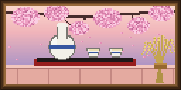 | `bar_cherry_blossom_sake` | 1x2 |
| 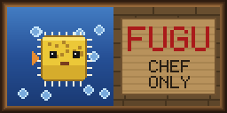 | `bar_fugu_warning` | 1x2 |
| 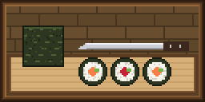 | `bar_kelp_maki` | 1x2 |
| 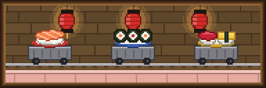 | `bar_minecart_kaiten` | 1x3 |
| 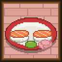 | `bar_plate_salmon_pair` | 1x1 |
|  | `bar_plate_tuna_tamago` | 1x1 |
| 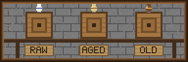 | `bar_sake_cellar` | 1x3 |
| 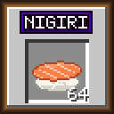 | `bar_slot_nigiri` | 1x1 |
| 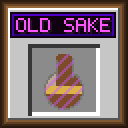 | `bar_slot_old_sake` | 1x1 |
|  | `bar_slot_onigiri` | 1x1 |
| 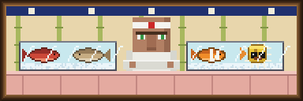 | `bar_villager_itamae` | 1x3 |
| 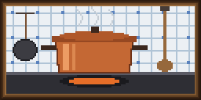 | `kitchen_copper_pot` | 1x2 |
| 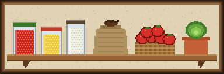 | `kitchen_harvest_shelf` | 1x3 |
| 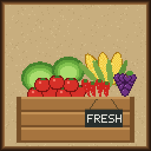 | `kitchen_market_crate` | 2x2 |
| 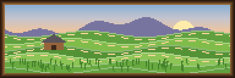 | `kitchen_rice_terraces` | 1x3 |
| 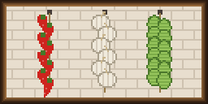 | `kitchen_ristra_garlic_hops` | 1x2 |
| 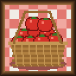 | `kitchen_tomato_basket` | 1x1 |
| 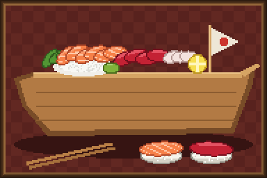 | `sushi_boat` | 2x3 |
| 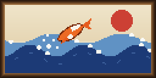 | `sushi_koi_wave` | 1x2 |
| 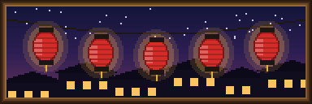 | `sushi_lantern_alley` | 1x3 |
| 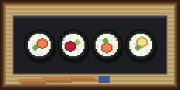 | `sushi_maki_platter` | 1x2 |
| 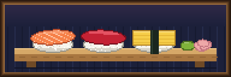 | `sushi_nigiri_trio` | 1x3 |
| 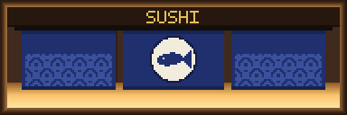 | `sushi_noren_curtain` | 1x3 |
| 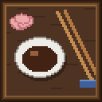 | `sushi_soy_chopsticks` | 1x1 |
